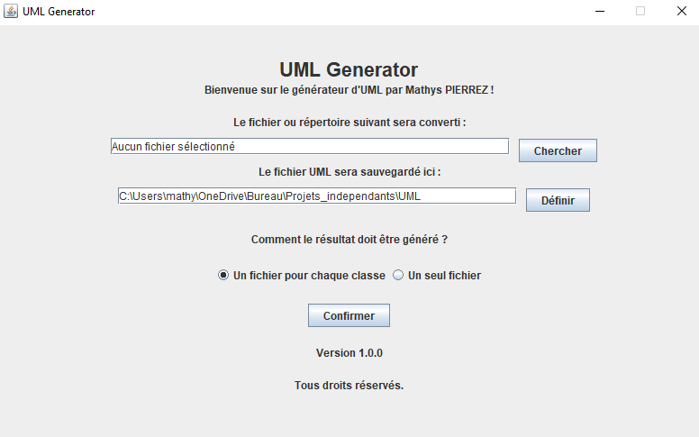

# UML Generator

Le générateur UML est un outil qui permet de générer des diagrammes UML à partir du code source Java. Il utilise la bibliothèque JavaParser pour analyser le code source et extraire les informations nécessaires à la création des diagrammes UML.

## Fonctionnalités

- Génération de diagrammes de classes UML à partir du code source Java.
- Prise en charge des relations de classes (associations, héritage, agrégation, composition, etc.).

## Fonctionnalités à venir
- Compatibilité avec du code C#
- Personnalisation des styles de diagramme (couleurs, polices, tailles, etc.).
- Exportation des diagrammes au format image (PNG, JPEG, etc.) ou au format vectoriel (SVG).

## Installation et utilisation
- Téléchargez [UML-Generator-1.0.0.jar](UML-Generator-1.0.0.jar)
- Choisissez le répertoire où vous voulez que le programme soit installé

Si tout s'est bien passé, vous devriez avoir un fichier "UML-Generator-1.0.0.jar" téléchargé sur votre ordinateur.

### Étapes d'exécution

- Une fois le fichier installé cliquez sur le fichier "UML-Generator-1.0.0.jar" et ouvrez le avec Java(TM) SE Platform binary, cela devrait vous ouvrir le menu principal.
- Sélectionnez un fichier ou un répertoire à convertir en cliquant sur le bouton "Chercher".
- Sélectionner un répertoire où l'UML sera sauvegardé en cliquant sur le bouton "Définir" (par défault ce sera le répertoire où vous vous trouvez actuellement).
- Choisissez si vous préfèrez que vos fichiers soient généré dans un fichier différent ou dans un même fichier.
- Cliquez sur le bouton "Confirmer" pour générer l'UML à l'endroit indiqué.

## Contribution

Les contributions à ce projet sont les bienvenues. Si vous souhaitez contribuer, veuillez suivre les étapes suivantes :

1. Fork ce dépôt.
2. Créez une branche pour votre fonctionnalité ou correction de bug : `git checkout -b ma-branche`
3. Effectuez les modifications nécessaires et committez vos changements : `git commit -am "Ajouter une nouvelle fonctionnalité"`
4. Poussez votre branche vers votre dépôt forké : `git push origin ma-branche`
5. Créez une pull request pour fusionner vos modifications dans la branche principale.

## Captures d'écran
Aperçu de la fenêtre principale:

Exemple de génération:

## Configuration requise
- Java version: 17.0.2
- Java Development Kit (JDK) 8 ou supérieur.
- Apache Maven 3.9.2 pour la gestion des dépendances.

## Erreurs fréquentes
Si vous n'arrivez pas à exécuter le fichier "UML-Generator-1.0.0.jar", assurez-vous d'avoir installé Java et que ce dernier soit à jour

### Procédure pour installer Java
1. Rendez-vous sur le site d'Oracle pour télécharger Java.
2. Cliquez sur Téléchargement gratuit de Java.
3. Cliquez sur Accepter et lancer le téléchargement gratuit.
4. Ouvrez le fichier téléchargé.
5. Dans l'assistant qui s'ouvre, cliquez sur Installer.
6. Java est alors téléchargé et installé.

### Procédure pour vérifier si Java est à jour
1. Ouvrez votre invite de commande sous Windows ou votre terminal sous Linux.
2. Tapez `java -version`.
3. Assurez-vous d'avoir la version `"17.0.2" 2022-01-18 LTS` au minimum.

## Auteurs
* **Mathys PIERREZ** _alias_ [@m.pierrez](https://git.unistra.fr/m.pierrez)

## Développé avec
* [Java 17.0.2" 2022-01-18 LTS](https://download.oracle.com/java/17/archive/jdk-17.0.2_windows-x64_bin.exe) - Langage de développement
* [IntelliJ IDEA 2021.3.2 (Community Edition)](https://www.jetbrains.com/fr-fr/idea/download/#section=windows) - Editeur de code
* [Apache Maven 3.9.2](https://maven.apache.org/download.cgi) - Gestion des dépendances
* [JavaParser 3.25.0](https://github.com/javaparser/javaparser) - Récupération des informations Java

## Versions
**Dernière version :** 1.0.0

**Dernière version stable :** 1.0.0

## Licence

Ce projet est sous licence GNU General Public License (GPL). Voir le fichier [LICENSE](LICENSE) pour plus de détails.